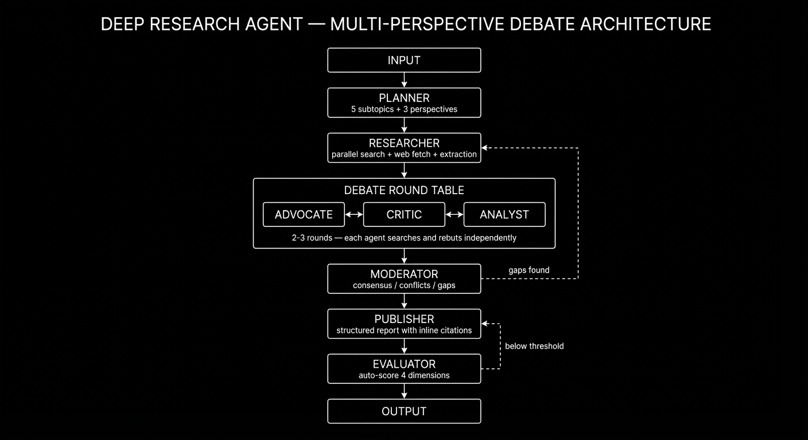

<p align="center">
  <h1 align="center">Deep Research Agent</h1>
  <p align="center">
    <strong>Multi-Perspective Debate Architecture for Autonomous Research</strong>
  </p>
  <p align="center">
    <a href="#quickstart">Quickstart</a> &nbsp;&bull;&nbsp;
    <a href="#architecture">Architecture</a> &nbsp;&bull;&nbsp;
    <a href="#how-it-works">How It Works</a> &nbsp;&bull;&nbsp;
    <a href="#sample-output">Sample Output</a> &nbsp;&bull;&nbsp;
    <a href="#configuration">Configuration</a>
  </p>
  <p align="center">
    
    
    
    
  </p>
</p>

---

## Why This Exists

Most AI research tools follow a simple pattern: take a query, search the web, summarize. The result is a shallow summary that reflects a single viewpoint with no critical analysis.

**The problem:** a single LLM has no reason to challenge its own conclusions. It won't argue against itself, question source reliability, or identify gaps in its reasoning. It produces *fluent* text, not *rigorous* analysis.

**This project takes a different approach.** Instead of one agent summarizing, it builds a **debate roundtable** where multiple AI agents with distinct roles (Advocate, Critic, Analyst) are forced to argue, rebut, and defend positions using real sources from the web. A Moderator synthesizes the debate, a Publisher writes the report, and an Evaluator scores the output — sending it back for revision if quality is below threshold.

The result is a research report that is:
- **Balanced** — multiple perspectives are structurally required, not optional
- **Evidence-based** — debaters search for their own counter-evidence in real-time
- **Self-correcting** — feedback loops catch gaps and quality issues before output
- **Cited** — every claim links back to its source

This was built as an experiment to test whether adversarial multi-agent debate produces better research than single-agent summarization. The results were surprisingly good — and the architecture is simple enough to extend.

---

## Architecture

<p align="center">
  
</p>

The system is a **directed graph with conditional loops**, built on [LangGraph](https://github.com/langchain-ai/langgraph). Each node is a specialized agent with its own LLM configuration, prompt, and role.

### Pipeline

```
INPUT → Planner → Researcher → Debate (2 rounds) → Moderator → Publisher → Evaluator → OUTPUT
              ↑                                          |                ↑            |
              └──────── gaps found ──────────────────────┘                └── < 7/10 ──┘
```

| Node | Role | What It Does |
|------|------|-------------|
| **Planner** | Decomposition | Breaks the query into 3-5 subtopics and creates 3 debate perspectives (Advocate, Critic, Analyst) |
| **Researcher** | Information Gathering | Searches the web via Tavily for each subtopic, fetches full page content, and extracts relevant evidence |
| **Debate** | Adversarial Analysis | 3 agents argue across 2 rounds. In round 2, each agent searches for *new* counter-evidence to rebut opponents |
| **Moderator** | Synthesis | Identifies consensus, conflicts, and knowledge gaps. Can trigger a new research cycle if gaps are found |
| **Publisher** | Report Writing | Generates a structured 3000+ word report with inline citations from the full debate transcript |
| **Evaluator** | Quality Control | Scores the report on 4 dimensions (Coverage, Balance, Citations, Depth). Below 7/10 average → Publisher rewrites |

### Feedback Loops

The graph has two conditional loops that make it self-correcting:

1. **Moderator → Researcher**: if the Moderator identifies knowledge gaps after synthesizing the debate, it generates new search queries and sends the Researcher back to fill them (max 1 extra cycle)
2. **Evaluator → Publisher**: if the report scores below 7/10 average, the Evaluator sends specific feedback and the Publisher rewrites (max 1 retry)

---

## How It Works

### The Debate Mechanism

This is the core of the system. Instead of one LLM producing a monologue, three agents with **structurally opposed roles** argue:

| Role | Behavior |
|------|----------|
| **Advocate** | Argues in favor. Highlights benefits, opportunities, positive evidence |
| **Critic** | Argues against. Points out risks, flaws, negative evidence |
| **Analyst** | Questions sources. Evaluates methodology, identifies bias, checks data quality |

**Round 1:** Each agent reads the research context and presents their initial position with evidence and confidence scores.

**Round 2:** Each agent reads the *other* agents' arguments, generates a targeted web search to find counter-evidence, and writes a rebuttal. This creates genuine adversarial dynamics — the Critic actively searches for evidence to dismantle the Advocate's claims, and vice versa.

The result is a debate transcript rich with claims, counter-claims, evidence, and unresolved questions — raw material for a nuanced report.

### Evaluation Dimensions

The Evaluator scores the final report on:

| Dimension | What It Measures |
|-----------|-----------------|
| **Coverage** | Were all aspects of the debate represented? |
| **Balance** | Were all perspectives treated fairly? |
| **Citations** | Are claims backed by inline source citations? |
| **Depth** | Does it include concrete data, statistics, names, dates? |

Reports scoring below 7.0/10 average are sent back with specific improvement feedback.

---

## Quickstart

### Prerequisites

- Python 3.12+
- [Tavily API key](https://tavily.com/) (web search)
- [OpenRouter API key](https://openrouter.ai/) (LLM access)

### Installation

```bash
git clone https://github.com/YOUR_USERNAME/deep-research.git
cd deep-research

python -m venv .venv
source .venv/bin/activate  # Linux/macOS
# .venv\Scripts\activate   # Windows

pip install -r requirements.txt
```

### Environment Variables

Create a `.env` file:

```env
OPENROUTER_API_KEY=your_openrouter_key
TAVILY_API_KEY=your_tavily_key
```

### Run

```bash
python main.py
```

Then type your research query at the prompt:

```
Research query > What is the impact of remote work on productivity and mental health?
```

The agent will run through the full pipeline and save the report to `final_result.txt`.

---

## Sample Output

The system produces comprehensive Markdown reports like this one, generated from the query *"Why were 1995-2005 cartoons so iconic for English-speaking countries?"*:

<details>
<summary><strong>Preview: report structure and quality</strong></summary>

```
# The 1995-2005 Animation Era: A Convergence of Art, Commerce, and Technology

## Executive Summary
(4 paragraphs with statistics: 85% US market share, 98.2% TV penetration, multi-billion franchise data)

## Arguments in Favor
(Creator-driven innovation, Anime Boom via Toonami, "mon" genre community-building — all with inline citations)

## Counter-arguments and Risks
("Merch-tainment" criticism, cultural homogenization data, Flash animation quality debate — all with inline citations)

## Source Quality Analysis
(Evaluation of Nielsen data reliability, nostalgia bias in fandom sources, academic vs. popular evidence)

## Points of Consensus
(US dominance, transformative role of anime, broadcast-to-cable structural shift)

## Points of Conflict
(Artistic merit vs. market saturation, globalization vs. homogenization, technology as democratization vs. cost-cutting)

## Conclusion
(Balanced synthesis: "Commercial Golden Age" — both genuine innovation and aggressive consumerism)

## Sources
(18 cited sources with URLs)
```

The full sample output is available in [`results/final_result.md`](results/final_result.md).

</details>

---

## Configuration

### Model Configuration

All LLM assignments are in `models.json`. Each agent can use a different model, provider, and temperature:

```json
{
  "planner": {
    "model": "google/gemini-3-flash-preview",
    "provider": "openai",
    "base_url": "https://openrouter.ai/api/v1",
    "api_key_env": "OPENROUTER_API_KEY",
    "temperature": 0.3
  },
  "moderator": {
    "model": "google/gemini-3-pro-preview",
    "temperature": 0.3
  },
  "publisher": {
    "model": "google/gemini-3-pro-preview",
    "temperature": 0.4,
    "max_tokens": 30000
  }
}
```

You can swap in any model available on OpenRouter (or any OpenAI-compatible provider) by editing this file. Higher-capability models for Publisher and Moderator tend to produce better reports.

### Prompt Engineering

All prompts are in `prompts/*.xml` using a simple `<system>` / `<user>` template format with `{variable}` substitution. Edit them to change agent behavior without touching code.

---

## Project Structure

```
deep-research/
├── main.py              # CLI entry point
├── graph.py             # LangGraph state graph definition
├── state.py             # Pydantic models + TypedDict state
├── models_config.py     # LLM initialization from models.json
├── models.json          # Per-agent model configuration
├── prompts.py           # XML prompt loader
├── display.py           # Rich terminal UI
├── requirements.txt     # Dependencies
├── nodes/
│   ├── planner.py       # Query decomposition
│   ├── researcher.py    # Web search + extraction
│   ├── debate.py        # Multi-agent debate (2 rounds)
│   ├── moderator.py     # Synthesis + gap detection
│   ├── publisher.py     # Report generation
│   └── evaluator.py     # Quality scoring + feedback
├── prompts/
│   ├── planner.xml
│   ├── researcher.xml
│   ├── debate_round1.xml
│   ├── debate_round2.xml
│   ├── moderator.xml
│   ├── publisher.xml
│   └── evaluator.xml
├── imgs/
│   └── readme-img.jpeg  # Architecture diagram
└── results/
    └── final_result.md  # Sample output
```

---

## Tech Stack

| Component | Technology |
|-----------|-----------|
| Orchestration | [LangGraph](https://github.com/langchain-ai/langgraph) |
| LLM Access | [LangChain](https://github.com/langchain-ai/langchain) + [OpenRouter](https://openrouter.ai/) |
| Web Search | [Tavily](https://tavily.com/) |
| Data Models | [Pydantic](https://docs.pydantic.dev/) |
| Terminal UI | [Rich](https://github.com/Textualize/rich) |

---

## Roadmap

This started as an experiment, but the architecture has room to grow:

- [ ] Parallel debater execution (currently sequential)
- [ ] Configurable number of debate rounds and perspectives
- [ ] Support for local LLMs (Ollama, vLLM)
- [ ] PDF/document ingestion as research sources
- [ ] Web UI with streaming debate visualization
- [ ] Export to PDF/HTML

---

## License

[MIT](LICENSE) — do whatever you want with it.

---

<p align="center">
  <sub>Built as an experiment in multi-agent adversarial research. If you find it useful, give it a star.</sub>
</p>
